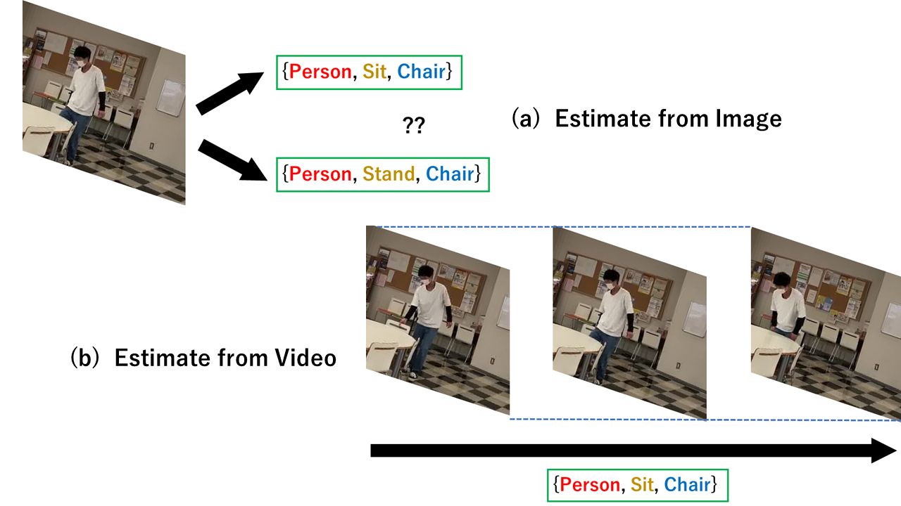
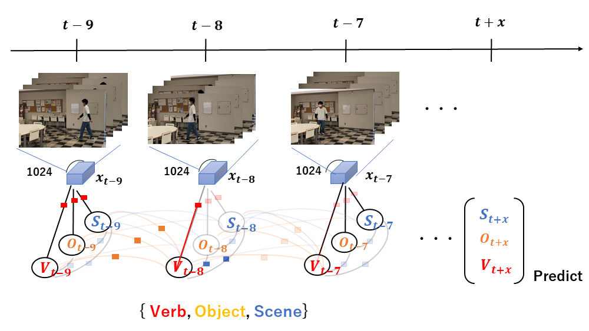

  

# Human Action Prediction considering the surrounding environment
Human action is predicted using ST-Graph (Spatio-Temporal Graph), which expresses the spatial-temporal relationship between a person and the surrounding environment on [Charades dataset](https://allenai.org/plato/charades/). 

Contact: Takuya Goto (goto@cv.nitech.ac.jp)
## Overview

### Relationship Reasoning in Videos

It is not possible to judge from one image(left) whether a person sits on a chair or stands. If we can consider not only the spatial arrangement but also the temporal change (right), correct estimation will be possible.

### Gated Spatio-Temporal Energy Graph

Represent the st-graph using the model of [Gated Spatio-Temporal Energy Graph](https://arxiv.org/pdf/1903.10547.pdf). Extract feature quantities of moving images by [I3D network](https://arxiv.org/pdf/1705.07750.pdf), then, by st-graph inference, predict **V** (Verb),**O** (Object) and **S** (Scene) x time ahead. 

## Usage

### Prerequisites
- Python 3.6
- [Pytorch and torchvision](https://pytorch.org/)

### Datasets
- [Charades dataset](http://ai2-website.s3.amazonaws.com/data/Charades_v1_rgb.tar)
- [Charades' Training and Validation Annotations](http://ai2-website.s3.amazonaws.com/data/Charades.zip)

### Pretrained Model
- Download the [pretrained (with Kinetics Dataset) I3D](https://arxiv.org/abs/1705.07750) model [here](https://www.dropbox.com/s/r6ja11h06y2w83c/rgb_i3d_pretrained.pt?dl=0). Note that I removed the last classifier layer, and append a new classifier layer for Charades.

### Run the Code
1. Modify exp/GSTEG_Prediction.py
    * Create the cache directory
    * Specify the location of the data, training/validation split, and pretrained model.
2. Command as follows
~~~~
python3 exp/GSTEG_Prediction.py
~~~~

### Acknowledgement
A large portion of the code comes from the [GSTEG](https://github.com/yaohungt/Gated-Spatio-Temporal-Energy-Graph), [Temporal Fields](https://github.com/gsig/temporal-fields/tree/master/pytorch), [VidVRD](https://github.com/xdshang/VidVRD-helper), and [ImageNet](https://github.com/pytorch/examples/tree/master/imagenet) repo.

